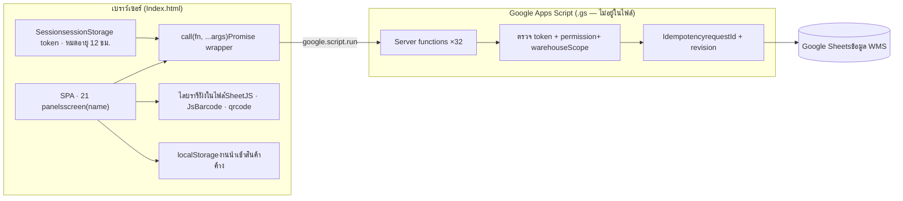
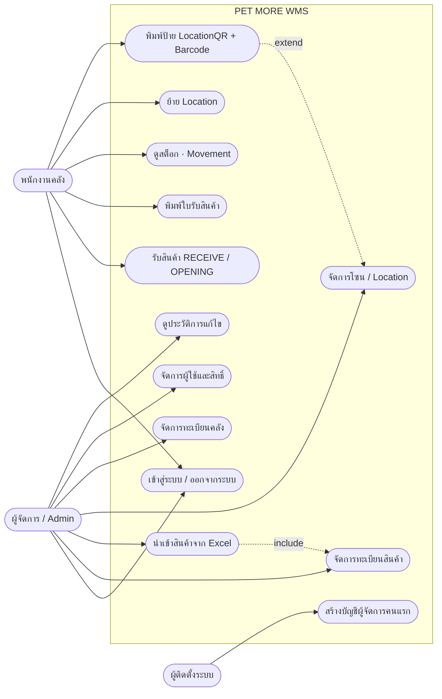
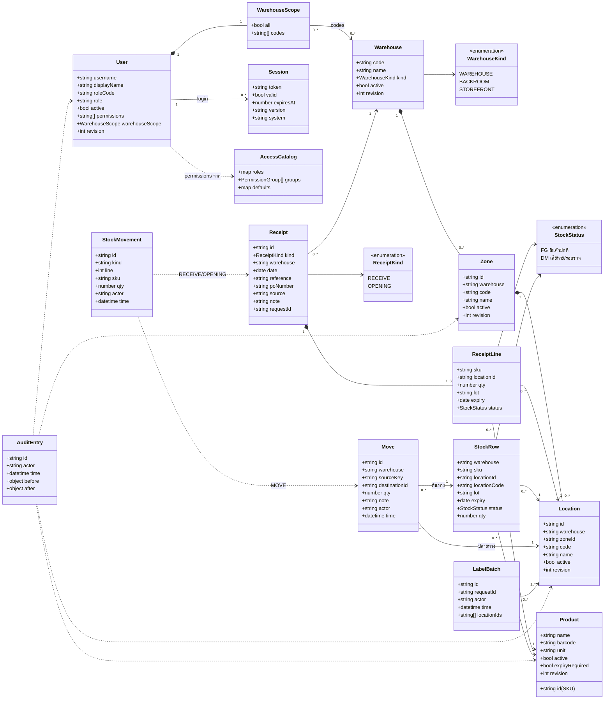
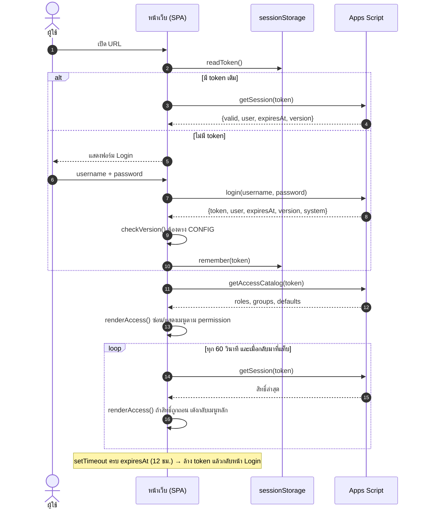
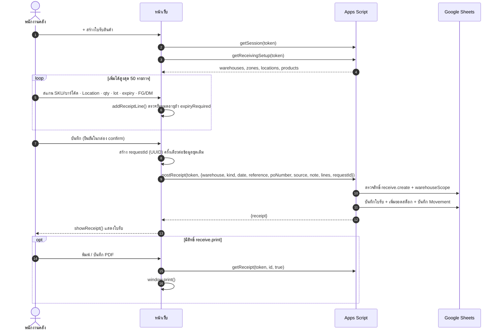
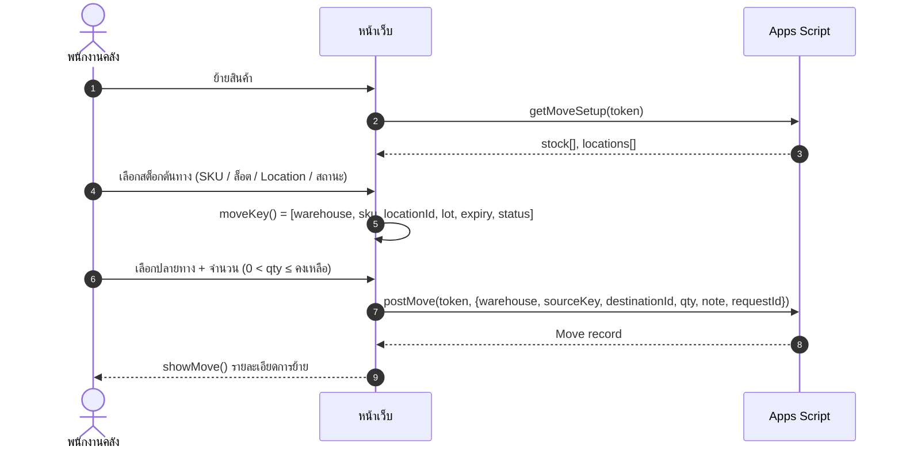
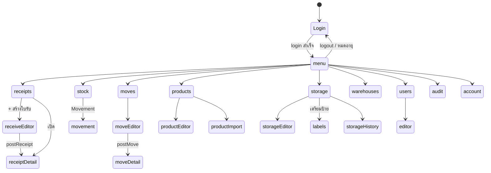

OMS (gs.) · Google Apps Script Web App

# PET MORE WMS — แผนภาพ UML

สรุปจากไฟล์ `OMS (gs.).txt` (หน้าเว็บ HTML ฝั่ง client \~3,200 บรรทัด) ที่เรียกฟังก์ชันฝั่งเซิร์ฟเวอร์ 32 ตัวผ่าน `google.script.run`

[ภาพรวมระบบ](#overview) [Use Case](#usecase) [Class Diagram](#class) [Sequence: Login](#seq-login) [Sequence: รับสินค้า](#seq-receive) [Sequence: ย้าย Location](#seq-move) [State: หน้าจอ](#state) [ตาราง API](#api)

ไฟล์นี้มีเฉพาะโค้ดฝั่งหน้าเว็บ (Index.html) ส่วนโค้ด `.gs` ฝั่งเซิร์ฟเวอร์ไม่ได้อยู่ในไฟล์ แผนภาพฝั่งเซิร์ฟเวอร์และโครงสร้างข้อมูลจึงอนุมานจาก payload ที่หน้าเว็บส่งและรับ ส่วนชื่อชีตจริงใน Google Sheets ไม่ปรากฏในไฟล์

Component Diagram

## ภาพรวมสถาปัตยกรรม

หน้าเว็บเป็น Single Page App ที่สลับ panel 21 หน้าจอ ทุกคำสั่งผ่านตัวช่วย `call(fn, token, …)` และก่อนทุก action จะตรวจ session ซ้ำ (`refreshIdentity`) รวมทั้งตรวจสิทธิ์ทุก 60 วินาที

Use Case Diagram

## ผู้ใช้และสิ่งที่ทำได้ตามสิทธิ์

สิทธิ์เป็นรายข้อ (permission keys) ไม่ผูกกับตำแหน่งตายตัว ตำแหน่ง (role) ใช้เป็นแค่ค่าเริ่มต้น เช่น `WH`

receive.viewreceive.createreceive.print stock.viewstock.printmove.viewmove.create products.managelocations.viewlocations.editlocations.print locations.manageusers.viewusers.manageusers.audit

Class Diagram

## โครงสร้างข้อมูล (Domain Model)

ทุก entity ที่แก้ไขได้มี `revision` สำหรับกันการบันทึกทับกัน และทุกคำสั่งเขียนแนบ `requestId` (UUID) เพื่อกันกดซ้ำ

Sequence Diagram

## เข้าสู่ระบบและตรวจสิทธิ์ต่อเนื่อง

Sequence Diagram

## รับสินค้าเข้าคลัง (postReceipt)

Sequence Diagram

## ย้าย Location ภายในคลัง (postMove)

State Diagram

## การเปลี่ยนหน้าจอ

ทุกการเปลี่ยนหน้าผ่าน `navigate()` ซึ่งถามก่อนออกถ้าฟอร์มยังไม่บันทึก (`formDirty`)

Server API

## ฟังก์ชันฝั่งเซิร์ฟเวอร์ที่หน้าเว็บเรียก (32 ตัว)

| โมดูล | ฟังก์ชัน | สิทธิ์ที่เกี่ยวข้อง |
| --- | --- | --- |
| Auth | `createManager` `login` `logout` `getSession` `getAccessCatalog` | — |
| ผู้ใช้ | `listUsers` `saveUser` `getUserAudit` `getWarehouseChoices` | users.view · users.manage · users.audit |
| คลัง | `listWarehouseRegistry` `saveWarehouse` | locations.manage |
| โซน / Location | `getStorageWorkspace` `saveStorageEntry` `deleteStorageEntry` `getStorageAudit` | locations.view · locations.edit |
| ป้าย | `prepareLocationLabels` `getLocationPrintHistory` | locations.print |
| สินค้า | `getProducts` `saveProduct` `setProductExpiryBulk` `previewProductImport` `commitProductImport` | products.manage |
| รับสินค้า | `getReceivingSetup` `postReceipt` `listReceipts` `getReceipt` | receive.view · receive.create · receive.print |
| สต็อก | `getStock` `getStockMovement` | stock.view · stock.print |
| ย้าย Location | `getMoveSetup` `postMove` `listMoveHistory` `getMove` | move.view · move.create |